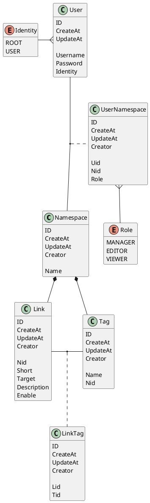
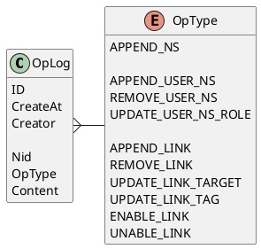
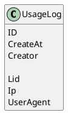

#

## 术语

name|means
-|-
Namespace|空间，简称ns
Link|一条短链接
Identity|一个用户在系统中的角色，Root是超级用户，User为普通用户
Uid|用户的唯一id
Nid|namespace的唯一id
Lid|Link的唯一id
Tid|Tag的唯一id

## 短路径黑名单

name|why
-|-
/|根路径
/root|超级后台
/admin|后台

## 访问频率限制

// TODO:

## 数据模型

// TODO: FolderView 和 Folder：在一个FolderView下，通过Tag组织起Folder。

## 日志

日志直接存储至业务数据库，（后续考虑采用mongo的oplog）  
ROLE和可以看到日志类型的对应关系写死到后端服务。

